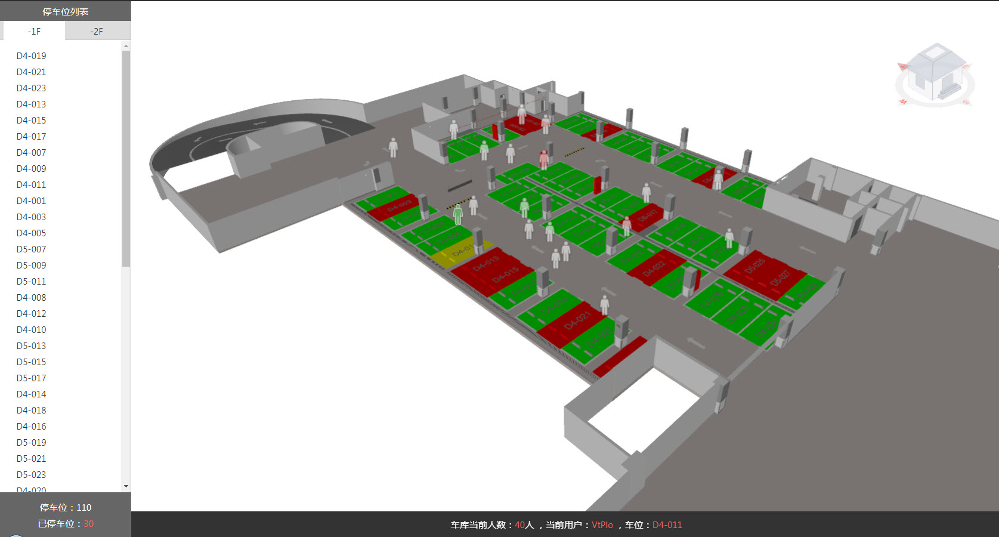

# 功能介绍

基于BIMFACE改变构件颜色的扩展功能，可以直观显示停车场内车库占用的比例情况。基于BIMFACE增加图片标签的扩展功能，同时结合室内定位装置读取的地下车库行人的实时坐标模拟行人的走动，点击行人的标签可以高亮显示对应的车位，实现车位引导的功能。

# 效果图


# 主要逻辑

通过BIMFACE服务端API和前端JavaScript API灵活使用构建停车场应用场景。

## 逻辑#1 - 构建停车场停车位列表

1. 通过调用BIMFACE服务端"获取文件转换的构件列表"API，根据构件类型ID、族和族类型获取"停车位"构件列表：
   * "获取文件转换的构件列表"API详见[http://doc.bimface.com/book/restful/articles/api/translate/get-ele-ids.html](http://doc.bimface.com/book/restful/articles/api/translate/get-ele-ids.html?p=doc)
   * JAVA-SDK调用示例如下：
```java
BimfaceClient bimfaceClient = new BimfaceClient(appKey, appSecret);
List<String> elements = bimfaceClient.getElements(fileId, categoryId, family, familyType);
```
2. 通过调用BIMFACE服务端"获取文件转换的构件属性"API，根据fileId、elementId获取构件属性：
   * "获取文件转换的构件属性"API详见[http://doc.bimface.com/book/restful/articles/api/translate/get-ele-prop.html](http://doc.bimface.com/book/restful/articles/api/translate/get-ele-prop.html?p=doc)
   * JAVA-SDK调用示例如下：
```java
PropertyBean propertyBean = bimfaceClient.getProperty(fileId, elementId);
```
示例代码段:
```java
BimfaceClient bimfaceClient = new BimfaceClient("Y3vZC8N79ia7JMNBGNBMYuRnJkf12345", "1TrD4kG3h4X2rc3bHa69abxk6sK12345");
Long fileId = 1187125317033123L;
List<String> elements = bimfaceClient.getElements(fileId, "-2000151", "车-停车位-基于面", "车-停车位-基于面");
for (String elementId : elements) {
    PropertyBean propertyBean = bimfaceClient.getProperty(fileId, elementId);
	
	//获取楼层属性
	PropertyGroup basicGroup = propertyBean.getProperties().stream().filter(propertyGroup -> propertyGroup.getGroup().equals("基本属性")).findFirst().get();
    String floor = basicGroup.getItems().stream().filter(propertyItem -> propertyItem.getKey().equals("floor")).findFirst().get().getValue().toString();

	//获取停车位编号属性
    PropertyGroup signGroup = propertyBean.getProperties().stream().filter(propertyGroup -> propertyGroup.getGroup().equals("标识数据")).findFirst().get();
    String parkNumber = signGroup.getItems().stream().filter(propertyItem -> propertyItem.getKey().equals("编号")).findFirst().get().getValue().toString();
	
	......
}
```
通过以上两个API就可以构建出停车位业务数据（停车位楼层、编号、是否停车等），有了相关业务数据可以提供前端随意使用。

## 逻辑#2 - 构建停车场停人员列表

根据业务真实场景，通过第三方设备实时采集停车场人员信息（人员编号、姓名、实时坐标、对应的停车位等）并提供应用使用。（此示例程序中，模拟了一些人员的实时数据，供前端使用达到动态活动的效果）

### 查看示例

[http://bimface.com/example/park](http://bimface.com/example/park)